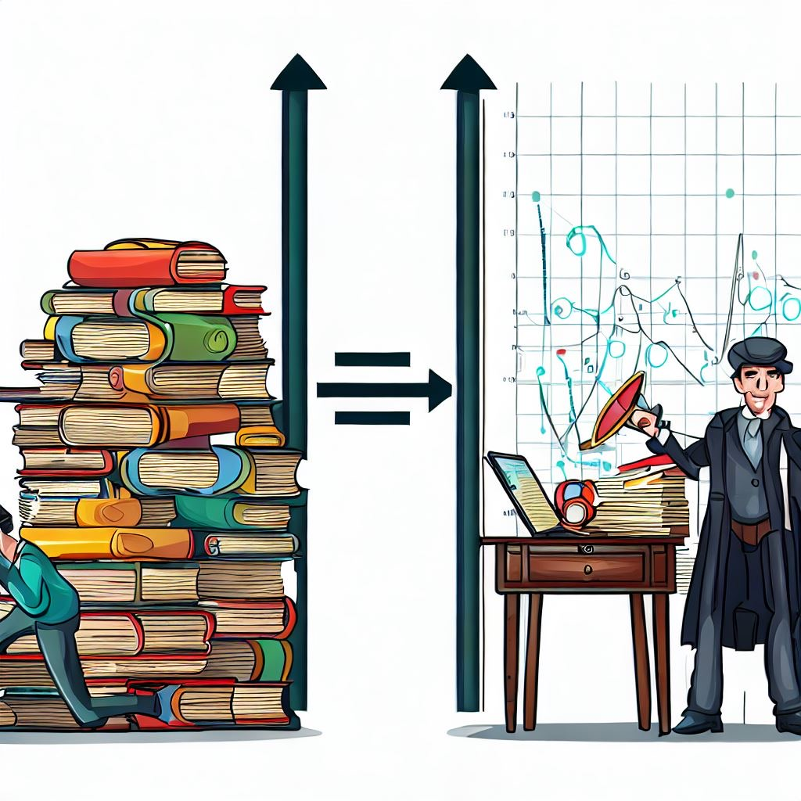

# Investigation Analysis Metrics

This project aims to quantify the 'goodness' of someone's analysis in an investigation by calculating different metrics that we can use to describe how people make sense of an investigation.


> Resulting image from Bing Image Creator Prompt: "I want to see Sherlock working on stacks of books on the left and a table of data, numerics, and visualization charts on the right. Place an arrow in between."

## Installation

Clone the repository to your local machine using the command `git clone https://github.com/jeremy-block/ProvMetrics.git`
Navigate to the project directory using the command `cd ProvMetrics`

Before running any other scripts, Install the required dependencies by running the command

```sh

npm install

```

*This script requires `python==3.10` and `spacy==5.3` - We recommend having python installed globally and use pip to install SpaCy. SpaCy is used for calculating the similarity of terms searched for in a dataset.*

## Usage

Prepare a folder containing the interaction history logs of the people doing investigations (JSON format. Each document is a session).
Run the main script by executing `node controller.js` in your terminal or command prompt.
The script will load in the data, calculate metrics and report the results in the output folder.

## Available Metrics

The following analysis metrics are calculated by the script: `controler.js`

**Interaction Counts.**

Additional information about each metric can be found in the [metric description](modules/metricdescription.md) file in the `modules` folder.

## Considered Metrics

The following are metrics we hope to calculate in the near future.

- **Interaction Rate** of events over the session (Search, document opens, topics covered, etc.)
  - Copy and Paste events to make notes
- **Breadth** vs **Depth** - These values are meant to describe the amount of topics being explored in a session. Are there many different topics, or mostly focused on one topic.
- Data **coverage** - of the topics they touched, how well did they cover each topic?
- Query Behavior
  - **Cycles** - repeated searches for similar topics - Searching for the same things - semantic similarity of words (**synonyms**), **Documents** (e.g., returning to the same document), language (**roots/endings**).
  - Query Activity rate - **Bursts** of activity - the rate of events - were they all at once or more spread out? Also, when did they occur? What can we learn about the events that happen in bursts vs those that happen in between?
  - **Filtering** of queries (manual sorting, secondary search behavior, some other way to reduce the dimensions/remove hundreds of columns for a search)
- **Uniqueness** - looking across all the sessions in a dataset, how similar are the topics being covered? Is this session more or less unique from the others?

### Contributing

If you want to contribute to this project, you can follow these steps:

### Fork the repository

1. Create a new branch and make your changes.
2. Test your changes thoroughly.
3. Commit your changes and push them to your forked repository.
4. Submit a pull request with a detailed explanation of your changes.

### License

This project is licensed under the GNU Public License - see the LICENSE file for details.
